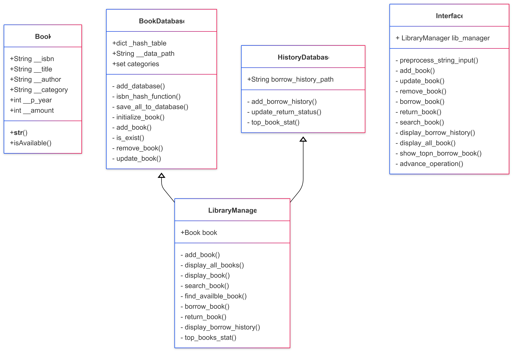
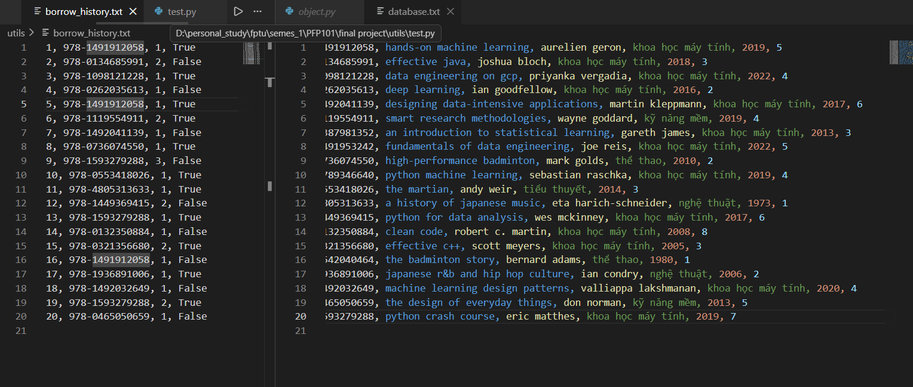
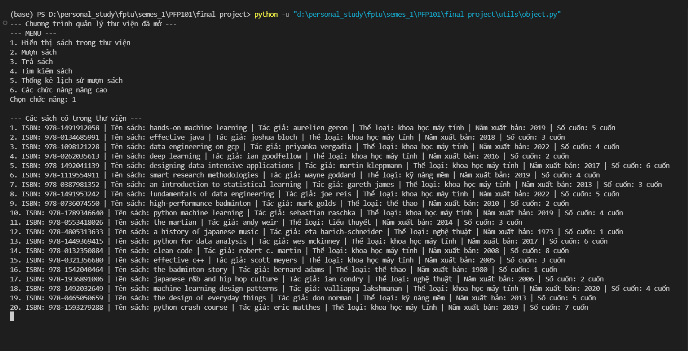
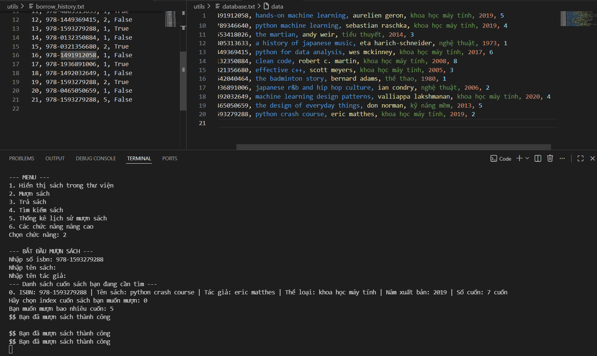
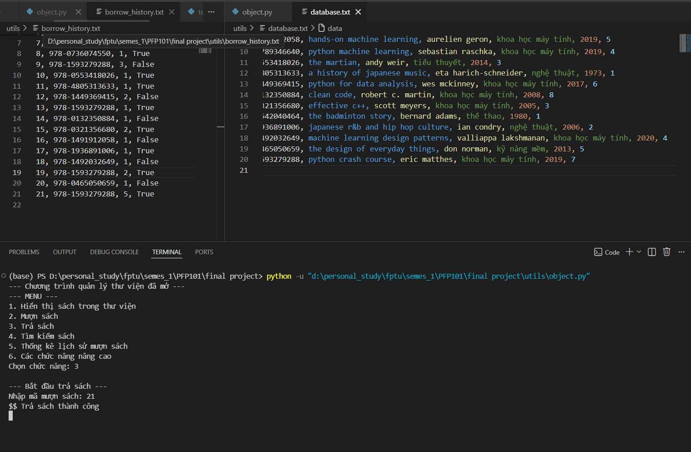
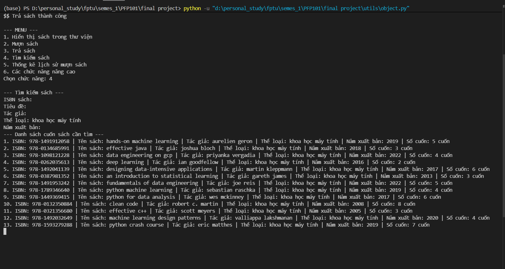
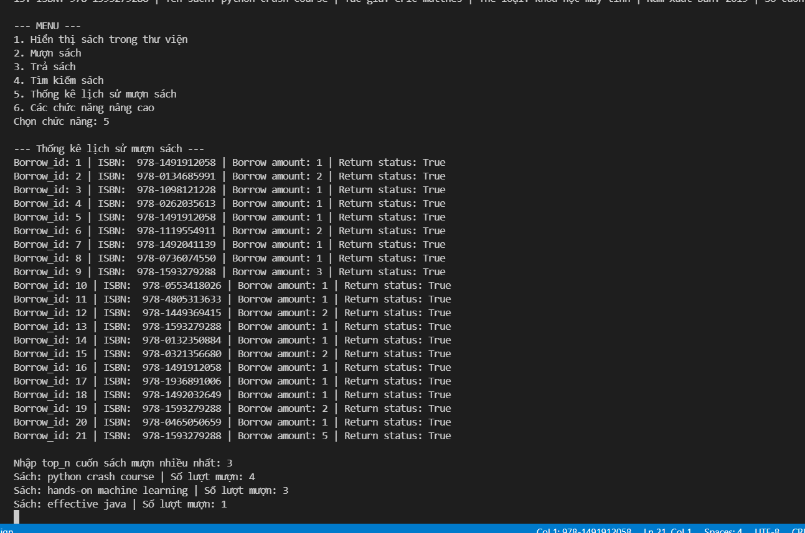

# TECHNICAL REPORT

**Course:** PFP191 - Programming Fundamentals with Python

**Project Topic:** Topic 2 - Book Management in the Library

**University:** FPT University

**Main contributor:** 1. Phan Lê Thanh Hùng - QE210207

**Instructor:** Khoa Nguyen

**Date:** 24/03/2026

---

## TABLE OF CONTENTS

1. Introduction
2. System Analysis and Design
3. Implementation Details
4. Advanced Features
5. Testing and Results
6. Conclusion

---

## 1. INTRODUCTION

### 1.1 Project Overview
In the digital era, automating library management is essential for enhancing operational efficiency and providing better services to users. This project focuses on designing and implementing a robust Python-based Console-Line Interface (CLI) application to manage library book records and borrowing histories. By transitioning from manual logs to a structured digital system, the application streamlines the tracking of library assets.

### 1.2 Project Objectives
The primary goal of this project is to develop a functional application that demonstrates a comprehensive understanding of core Python programming concepts as required by the PFP191 syllabus. Specifically, the project aims to:
* Apply **Object-Oriented Programming (OOP)** principles including encapsulation, properties, and multiple inheritance.
* Implement efficient data management using advanced structures like Dictionaries (Hashtables).
* Ensure data persistence through robust File I/O operations (`.txt` files).
* Organize code using Modular Programming best practices (`models/`, `services/`, `utils/`).

### 1.3 Scope of Work
The system covers the following functional areas:
* **Book Data Management:** Full CRUD (Create, Read, Update, Delete) capabilities for book records.
* **Borrowing and Returning:** Lifecycle management of book loans and inventory tracking.
* **Search Functionality:** Multi-criteria search filters (ISBN, Title, Author, etc.).
* **Statistics:** Automated reporting on borrowing trends using data analysis techniques.

---

## 2. SYSTEM ANALYSIS AND DESIGN

### 2.1 Functional Requirements
Based on the project prompt, the application interacts with users via a Console-Based menu providing six main functionalities: Displaying all books, Borrowing a book, Returning a book, Searching, Statistical Reporting, and Advanced Operations (CRUD).

### 2.2 Class Architecture (UML Design)
The system is designed with a high degree of cohesion and low coupling, utilizing the following classes:
* `Book`: Represents the data model of a book. It stores attributes such as ISBN, title, author, category, publication year, and available amount.
* `BookDatabase`: Handles persistent storage and RAM-based indexing (Hashtable) for books.
* `HistoryDatabase`: Manages the logging of borrowing transactions and return statuses.
* `LibraryManager`: The core controller class that utilizes **Multiple Inheritance** `class LibraryManager(BookDatabase, HistoryDatabase)` to orchestrate interactions between the book inventory and borrowing history.
* `Interface`: Manages the CLI, input preprocessing, and user interactions.



### 2.3 Modular Structure
To adhere to the "Modular Design" technical requirement, the codebase is separated into logical packages:
* `/models`: Contains the `Book` class.
* `/services`: Contains `BookDatabase`, `HistoryDatabase`, and `LibraryManager`.
* `/utils`: Contains the `database.txt` and `borrow_history.txt` files.
* `main.py`: The entry point of the application.

---

## 3. IMPLEMENTATION DETAILS

### 3.1 Object-Oriented Programming (OOP) Paradigm
**Encapsulation and Data Protection:**
Direct access to book attributes is restricted using private variables (e.g., `__isbn`, `__title`). To allow safe modifications, the `@property` decorator is implemented. This enables strict input validation; for instance, the ISBN setter checks if the string length is valid before assignment, preventing corrupted data from entering the database.

```python
@property
def isbn(self):
    return self.__isbn

@isbn.setter
def isbn(self, value):
    if len(value) < 10:
        raise ValueError("Invalid ISBN format!")
    self.__isbn = value
```

* **Inheritance Architecture:** The `LibraryManager` class utilizes multiple inheritance, inheriting directly from both `BookDatabase` and `HistoryDatabase`. This design allows the manager to act as a centralized controller, seamlessly bridging inventory management with transaction logging without duplicating code.

### 3.2. Advanced Data Structures: Hashing Algorithm
To address the performance limitations of standard Python `lists` (which require $O(n)$ time for lookups), the application implements a custom index using `collections.defaultdict(list)`.
* **Polynomial Rolling Hash:** The system translates alphanumeric ISBN strings into numerical bucket indices via a custom `isbn_hash_function`. It iterates through the ASCII values of the ISBN characters, multiplying them by a prime base ($p=31$), and applies a modulo operation against a large prime `table_size` (10007).

```python
def isbn_hash_function(self, isbn : str, table_size=10007) -> int:
        hash_val = 0
        p = 31  # Một số nguyên tố nhỏ
        
        # Loại bỏ dấu gạch ngang nếu có
        clean_isbn = isbn.replace("-", "").strip()
        
        for char in clean_isbn:
            char_val = ord(char)
            hash_val = (hash_val * p + char_val) % table_size
            
        return hash_val
```
* **Collision Resolution:** Because the Hashtable uses a `defaultdict(list)`, it natively resolves hash collisions using "Separate Chaining." If two distinct ISBNs generate the same hash key, both `Book` objects are safely appended to the same list bucket, preserving data integrity.

### 3.3. File I/O and Data Persistence
The architecture treats the RAM (the Hashtable) as the "Single Source of Truth" during runtime, optimizing read/write speeds, while ensuring periodic synchronization with persistent `.txt` files.
* **Initialization:** Upon system startup, `database.txt` is ingested. Lines are stripped of whitespace and trailing newline characters, then parsed into `Book` objects and hashed into memory.
* **The "Overwrite" Synchronization Strategy:** To avoid the complexities and potential corruption of updating specific lines within a sequential text file, the system uses the `save_all_to_database()` method. Triggered after any mutative operation (Add, Update, Delete), this method opens the file in write mode (`'w'`), wiping the old data, and rapidly serializes the entire current state of the RAM back to the disk. 

---

## 4. ADVANCED FEATURES

### 4.1. Transaction Logging and Status Tracking
The `HistoryDatabase` independently manages the lifecycle of book loans. When a user borrows a book, a new record is appended to `borrow_history.txt` with an auto-incrementing `borrow_id` and a `return_status` of `False`. Upon returning the book, the system reads the history file into memory, locates the specific transaction by its ID, toggles the status to `True`, and overwrites the file. This ensures an immutable audit trail of all library activities.ư

```python
class HistoryDatabase:
    def __init__(self, borrow_history_path):
        self.borrow_history_path = borrow_history_path

    def add_borrow_history(self, isbn, borrow_amount):
        with open(self.borrow_history_path, 'a+') as file:
            file.seek(0)
            tempo = file.readlines()
            if len(tempo) == 0:
                borrow_id = 1
            else:
                previous_id = int(tempo[-1].strip('\n').split(',')[0])
                borrow_id = previous_id + 1
                return_status = False
            new_record = f'{borrow_id}, {isbn}, {borrow_amount}, {return_status}\n'
            file.writelines(new_record)
    
    def update_return_status(self, borrow_id) -> str: #Trả về isbn để cập nhập database
        ...
```

### 4.2. Statistical Analytics and Reporting
Fulfilling the advanced requirements of the curriculum, the application includes a data analytics module to track user reading habits.
* **Frequency Counting:** Utilizing Python's built-in `collections.Counter`, the `top_book_stat` method extracts all ISBNs from the borrowing history file.
* **Insights Generation:** The `Counter.most_common(n)` function efficiently computes the top $n$ most frequently borrowed books. The `LibraryManager` then cross-references these winning ISBNs with the `BookDatabase` to display full book titles alongside their borrowing frequencies. This feature serves as a critical decision-support tool for librarians to identify popular genres and allocate purchasing budgets effectively.

---

## 5. TESTING AND RESULTS

### 5.1. Testing Methodology
The system underwent extensive manual testing focusing on edge cases, invalid inputs, and state synchronization between RAM and Disk.
* **Data Integrity Testing:** Attempting to instantiate a `Book` with a short ISBN successfully triggered the expected `ValueError`. 
* **Concurrency Testing:** Borrowing a book successfully decremented the `amount` property in memory and immediately reflected in the `database.txt` file. Over-borrowing (requesting more copies than available) successfully triggered a blocking exception.
* **Hash Integrity:** Stress-testing the `is_exist` method confirmed that duplicate ISBNs were rejected correctly, proving the reliability of the Polynomial Rolling Hash function.

### 5.2. User Interface Demonstration
The Command Line Interface (CLI) provides a clean, continuous loop for user interaction, utilizing `match-case` statements for intuitive menu navigation. Output is formatted clearly utilizing the overridden `__str__` magic method within the `Book` class.

* **Original book dataset**


* **Operation 1: Show book data**


* **Operation 2: Borrow book**


* **Operation 3: Return book**


* **Operation 4: Search engine**


* **Operation 5: Statics & reports**


---

## 6. CONCLUSION

### 6.1. Project Evaluation
The developed Library Management System successfully fulfills all functional and technical criteria outlined in the PFP191 Topic 2 assignment. The project goes beyond basic procedural scripting by enforcing strict Object-Oriented Principles and deploying advanced algorithmic structures (Hashtables and Short-Circuit searching). The integration of robust Exception Handling and an automated Analytics Module ensures the software is both resilient and highly practical.

### 6.2. System Limitations
Currently, the system's reliance on plain text files for storage is a bottleneck for extreme scalability. While the "overwrite" persistence strategy is highly effective for a university-level project, it is not optimized for simultaneous multi-user environments due to a lack of concurrency locking mechanisms. 

### 6.3. Future Enhancements
To evolve this application into a production-ready system, future iterations should replace `.txt` files with a Relational Database Management System (RDBMS) such as SQLite or PostgreSQL. Additionally, transitioning the Interface from a CLI to a Graphical User Interface (GUI) via `Tkinter`, or a web-based dashboard using `Flask`, would significantly enhance accessibility and user experience.